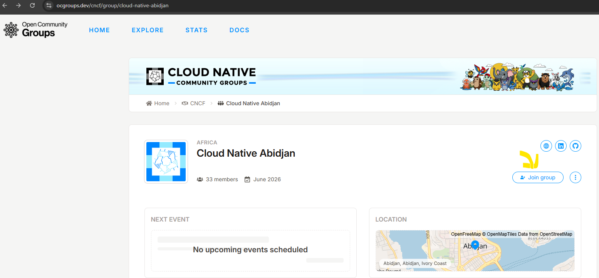
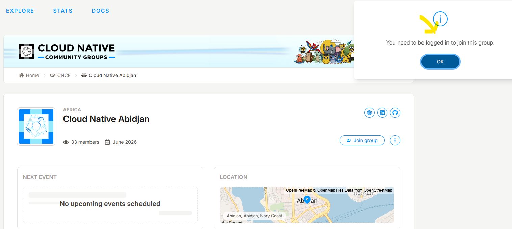
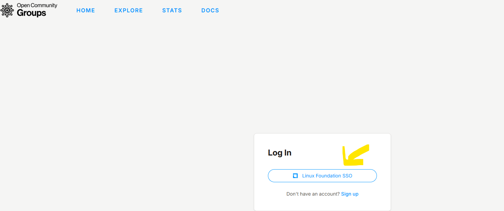
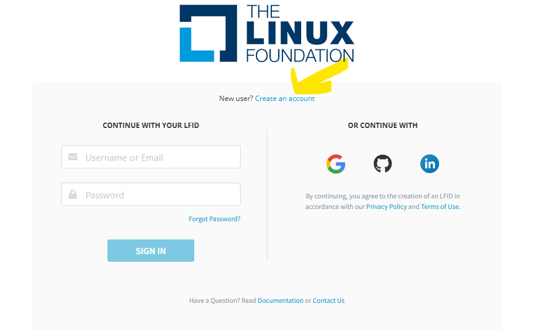

# Rejoindre Cloud Native Abidjan

Bienvenue dans la communauté ! 🚀

L'inscription est **gratuite** et ne prend que quelques minutes.

[:material-account-plus: Rejoindre maintenant](https://ocgroups.dev/cncf/group/cloud-native-abidjan){ .md-button .md-button--primary }

---

## 1. Ouvrir la page Cloud Native Abidjan

Rendez-vous sur la page officielle :

**https://ocgroups.dev/cncf/group/cloud-native-abidjan**

Cliquez ensuite sur **Join group**.

---

## 2. Se connecter

Si vous n'êtes pas connecté, la plateforme vous demande de vous connecter.

Cliquez sur **Linux Foundation SSO**.

> Selon votre parcours, vous pouvez ensuite être redirigé vers la page de connexion Linux Foundation.

---

## 3. Créer un compte si nécessaire

Si vous n'avez pas encore de compte Linux Foundation, cliquez sur **Create an account**.

Renseignez :

- Prénom
- Nom
- Email
- Nom d'utilisateur
- Mot de passe

Puis cliquez sur **Create Account**.

---

## 4. Finaliser puis rejoindre CNA

Une fois votre compte créé et connecté, revenez sur :

**https://ocgroups.dev/cncf/group/cloud-native-abidjan**

Cliquez à nouveau sur **Join group**.

🎉 **Vous faites maintenant partie de Cloud Native Abidjan !**

---

## 🎯 Pourquoi rejoindre CNA ?

En rejoignant la communauté, vous pouvez :

- 📚 découvrir et apprendre ;
- 🎤 participer à des meetups et proposer des sujets ;
- 🛠️ participer à des ateliers pratiques ;
- 🤝 échanger avec d'autres passionnés du Cloud Native ;
- 💡 partager votre expérience ;
- 🌍 contribuer à l'écosystème Cloud Native en Côte d'Ivoire.

## 🔗 Ensuite ?

Rejoignez également nos espaces communautaires :

- **[LinkedIn](https://www.linkedin.com/company/cloud-native-abidjan/)**
- **[GitHub](https://github.com/Cloud-Native-Abidjan)**
- **[WhatsApp](https://chat.whatsapp.com/BqhizdWbC4e1lpPcJiCayW)**

**Learn • Share • Build • Together**
