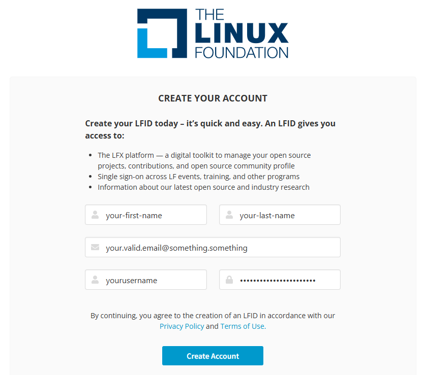

---
hide:
  - toc
---

# Rejoindre Cloud Native Abidjan

Bienvenue dans la communauté ! 🚀

**L’inscription est gratuite et ne prend que quelques minutes.**

<a class="md-button md-button--primary" href="https://ocgroups.dev/cncf/group/cloud-native-abidjan">Rejoindre maintenant</a>

<strong>1 · Ouvrir</strong>La page CNA

<strong>2 · Se connecter</strong>Linux Foundation

<strong>3 · Créer</strong>Un compte si nécessaire

<strong>4 · Rejoindre</strong>Le groupe CNA

!!! tip "Vous avez déjà un compte Linux Foundation ?"
    Passez directement à l’étape 2.

## 1. Ouvrir la page Cloud Native Abidjan

Ouvrez la [page officielle de Cloud Native Abidjan](https://ocgroups.dev/cncf/group/cloud-native-abidjan), puis cliquez sur **Join group**.

<figure class="cna-screenshot">
  
  <figcaption class="cna-caption">1 · Ouvrir la page CNA et cliquer sur <strong>Join group</strong></figcaption>
</figure>

## 2. Se connecter

Si vous n’êtes pas encore connecté, un message vous indique que vous devez vous connecter.

Cliquez sur **OK**, puis sélectionnez **Linux Foundation SSO**.

<figure class="cna-screenshot">
  
  <figcaption class="cna-caption">2 · Confirmer la connexion</figcaption>
</figure>

Puis choisissez **Linux Foundation SSO**.

<figure class="cna-screenshot">
  
  <figcaption class="cna-caption">3 · Choisir Linux Foundation SSO</figcaption>
</figure>

Si vous avez déjà un compte, connectez-vous avec vos identifiants.

## 3. Créer un compte si nécessaire

Vous n’avez pas encore de compte Linux Foundation ? Cliquez sur **Create an account**.

<figure class="cna-screenshot">
  
  <figcaption class="cna-caption">4 · Cliquer sur <strong>Create an account</strong></figcaption>
</figure>

Renseignez simplement :

- Prénom
- Nom
- Email
- Nom d’utilisateur
- Mot de passe

Puis cliquez sur **Create Account**.

<figure class="cna-screenshot">
  
  <figcaption class="cna-caption">5 · Renseigner les informations puis créer le compte</figcaption>
</figure>

## 4. Revenir sur CNA et rejoindre le groupe

Une fois votre compte créé et connecté, retournez sur la [page Cloud Native Abidjan](https://ocgroups.dev/cncf/group/cloud-native-abidjan).

Cliquez à nouveau sur **Join group**.

!!! success "C’est fait 🎉"
    Vous faites maintenant partie de **Cloud Native Abidjan**.

## Pourquoi rejoindre CNA ?

- 📚 Découvrir et apprendre
- 🎤 Participer aux meetups et proposer des sujets
- 🛠️ Participer à des ateliers pratiques
- 🤝 Échanger avec d’autres passionnés du Cloud Native
- 💡 Partager votre expérience
- 🌍 Contribuer à l’écosystème Cloud Native en Côte d’Ivoire

### Et maintenant ?

Retrouvez-nous aussi sur :

**[LinkedIn](https://www.linkedin.com/company/cloud-native-abidjan/)** ·
**[GitHub](https://github.com/Cloud-Native-Abidjan)** ·
**[WhatsApp](https://chat.whatsapp.com/BqhizdWbC4e1lpPcJiCayW)**

Une question ? **[Écrivez-nous](mailto:cloudnativeabidjan@gmail.com)**.

